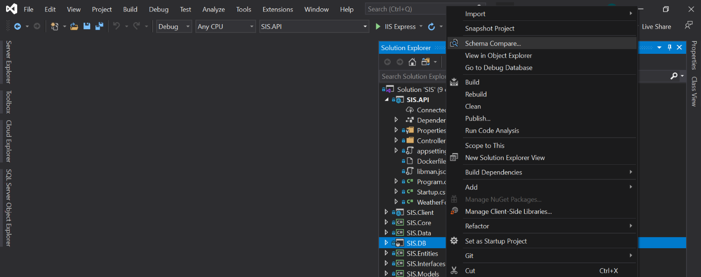
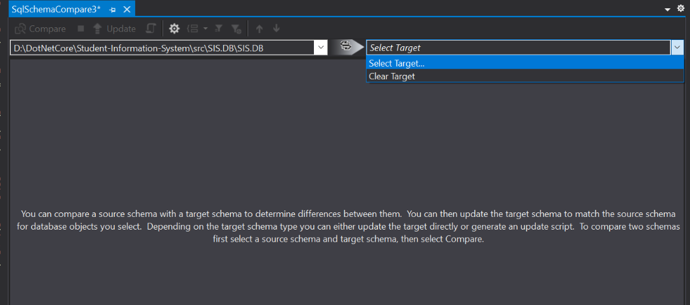
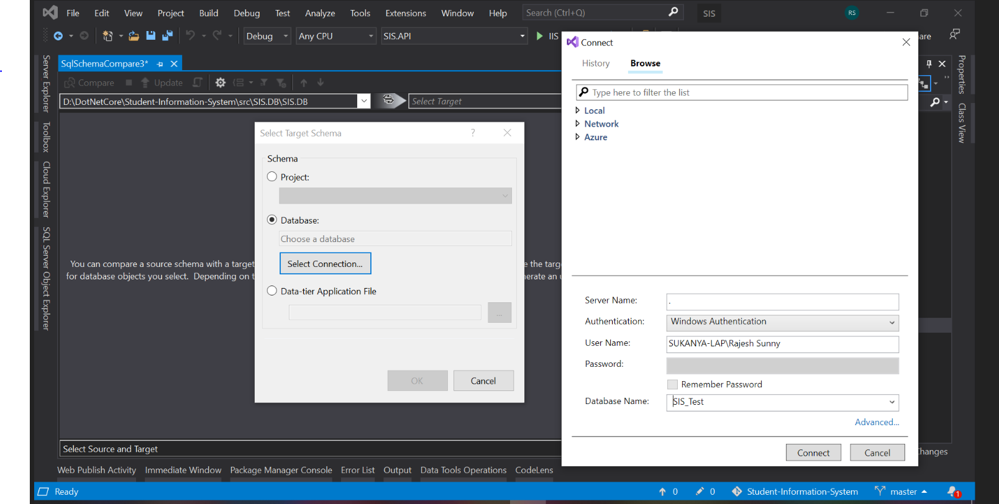
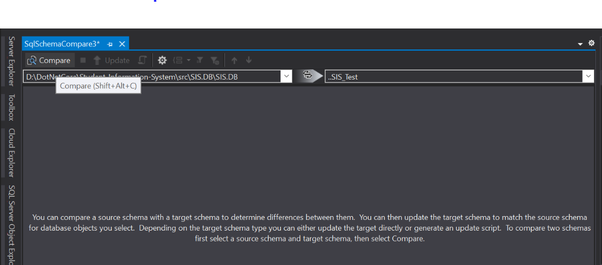
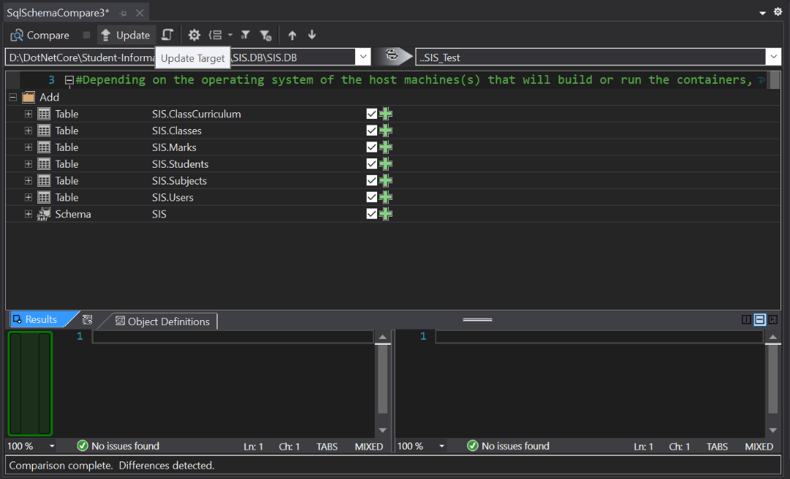
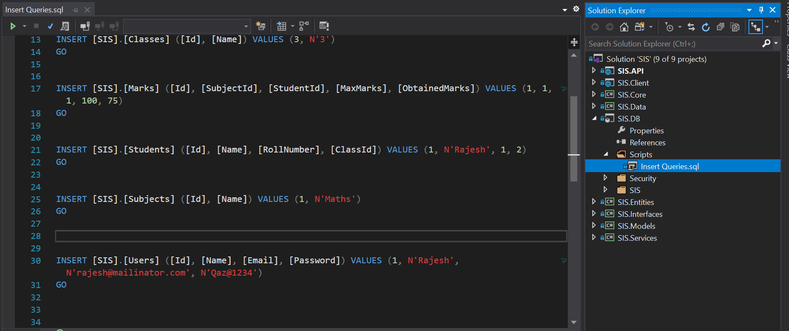

# Student Information System


## Developed Using 
- [.NET Core](https://www.microsoft.com/net/core/platform)
- [Entity Framework Core](https://docs.microsoft.com/en-us/ef/core/)
- [Blazor](https://dotnet.microsoft.com/apps/aspnet/web-apps/blazor)

## Run on Visual Studio - You should have Visual Studio installed along with .Net Core SDK
  1. Clone or Download the reposirtory.
  2. Open ```/Student-Information-System/src``` solution file.
  3. Build it.
  4. Run it! (Don't forget to set up the DB and change the connection string before running it 😉)
  
## Setup DB and Change Connection String
  1. In Visual Studio right click on ```/SIS/SIS.DB/SIS.DB.sqlproj``` project file.
  2. Click on ```Schema Compare``` in the context menu. 
    
    
  3. Make your DB as target DB by following the screenshots.
    
    
    
  4. Click on Compare to compare source DB with target DB.
    
    
  5. Click on Update target to update the objects from source DB to your DB.
    
    
  6. Now Find the Insert queries in the folder path as shown below and execute them in your local SQL Server
    
    
  7. Change connection string in ```/SIS/SIS.API/appsettings.json``` file with key ```ConnectionString```
  8. Now you are ready to go 🥳🥳
  
  
   By now after running if you go to `/swagger` URL you should be seeing the gorgeous Swagger UI 😍
   
  
